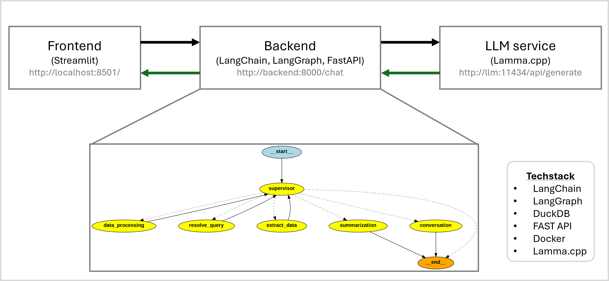
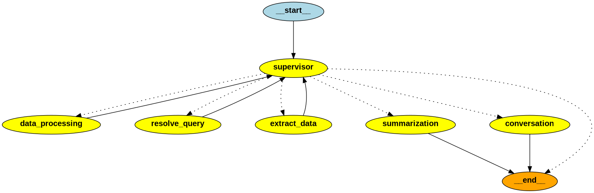
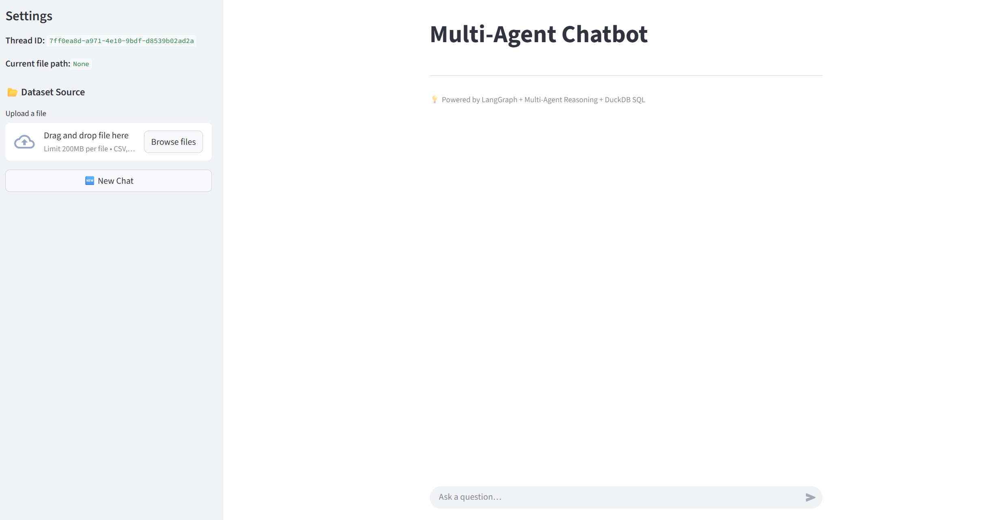

## 📊 Multi-agent for Conversation and Data analytics

### Features
* LangGraph (multi-agent orchestration)
* DuckDB (in-memory SQL analytics)
* LLM reasoning (DeepSeek / Ollama / OpenAI)
* Streamlit frontend
* FastAPI backend
* Docker Compose deployment
* Local LLM serving

## 📸 Architecture Overview
Pipeline Overview |
:-------------------------:


Multi-Agent Swarm |
:-------------------------:


Frontend Interface |
:-------------------------:


## Agents task:
* supervisor → Supervisor agent routing between workers
* data_processing → Load the data and process 
* resolve_query → Natural language → SQL
* extract_data → Executes SQL via DuckDB
* summarization → Generates insights from SQL output
* conversation → General chit-chat

## 📁 Folder Structure
```
retail-insights/
│
├── backend/
│   ├── app.py                  # FastAPI API + streaming endpoints
│   ├── backend.py              # LangGraph workflow
│   ├── requirements.txt
│   ├── Dockerfile
│
├── frontend/
│   ├── app.py                  # Streamlit Frontend UI
│   ├── requirements.txt
│   ├── Dockerfile
│
└── docker-compose.yml          # Running pipeline
```

## 🚀 Run the application (Docker Compose)
Run the pipeline with following command
```bash
docker compose up --build
```

Access the services:
* Frontend (Streamlit) → http://localhost:8501
* Backend (FastAPI) → http://localhost:8000

## ⚙️ Configuration

The Streamlit sidebar allows you to:
* Input a new file path manually
* Automatically reload the chatbot with the new dataset

Others
* Changing the LLM model in backend/backend.py:
```bash
supervisor_llm = ChatOllama(model="deepseek-r1:8b", temperature=0.0)
agent_llm = ChatOllama(model="deepseek-r1:8b", temperature=0.0)
summary_llm = ChatOllama(model="deepseek-r1:8b", temperature=0.0)
conv_llm = ChatOllama(model="deepseek-r1:8b", temperature=0.7)
```